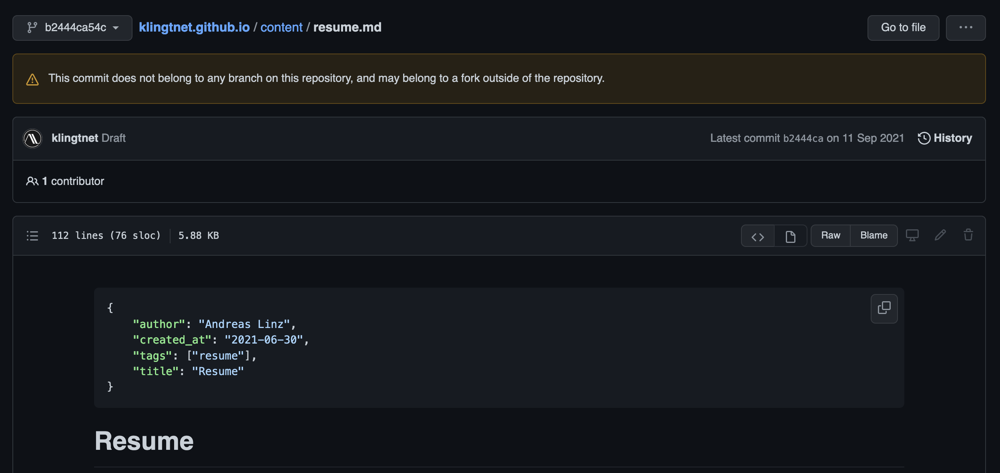

```json
{
  "author": "Andreas Linz",
  "title": "How to delete unreachable commits on GitHub",
  "description": "GitHub's search revealed a file in one of my repositories that should not have been published.  The file was part of a commit that was unreachable or free-standing, meaning it was not part of any branch.  In this article I will describe how to find and delete such commits.",
  "created_at": "2022-02-04"
}
```
# How to delete unreachable commits on GitHub

The dangling[^1] [commit](https://github.com/klingtnet/klingtnet.github.io/blob/b2444ca54c74a7c9dde6504cf028b6c0f4729d8f/content/resume.md#L3) shown in the screenshot below should have never been on GitHub, at least not publicly visible.  The commit was part of a branch called `draft` that I pushed to the repository when it was still private.  If I am not mistaken then I removed the file, squashed and merged the `draft` branch into `master`, deleted the branch and then pushed it onto GitHub.  After making sure that branch `draft` was gone on GitHub I made the repository public.



As you can clearly see the commit is still there, and I only discovered this by accident when using GitHub's search.  So, the question is now how to delete this commit?  I cannot even reach the commit from my local repository:

```shell
$ git show b2444ca54c74a7c9dde6504cf028b6c0f4729d8f
fatal: bad object b2444ca54c74a7c9dde6504cf028b6c0f4729d8f
```

Its parent commit is reachable though:

```shell
$ git show 01aea0c8e1bdceb7869403814a4ebb87e25883b2
commit 01aea0c8e1bdceb7869403814a4ebb87e25883b2
Author: Andreas Linz <klingt.net@gmail.com>
Date:   Sun Jul 25 16:18:10 2021 +0200

    Initial commit
```

If the commit would still be part of my local repository I could have removed it with this call and subsequent `git push`.

```shell
$ git reflog expire --expire-unreachable=all
```

But, nothing happens since the commit is not in my local repository.  What to do now 🤔?  As far as I see there is nothing I can do locally and cloning the repository will also omit the commit I want to delete.  GitHub must trigger the garbage collection for this repository so I [opened a ticket](https://support.github.com/ticket/) with them.  What really amazed me was how fast they responded, after 10 minutes everything was done and that's for a free account!  Here's what they wrote in the response:

> As you mentioned, it does indeed appear to be an an unreferenced commit dangling in our cache. I went ahead and performed the garbage collection and cache clearance operations for the repository klingtnet/klingtnet.github.io. Attempting to access the commit directly now returns a 404.

Luckily the commit contained no secrets, but what I learned from this lesson is that I need to double or triple check the contents of my repository before making it public on GitHub.  A simple deletion of a branch might not be sufficient.

[^1]: Dangling, free-standing, unreachable or unreferenced, all terms fit here.