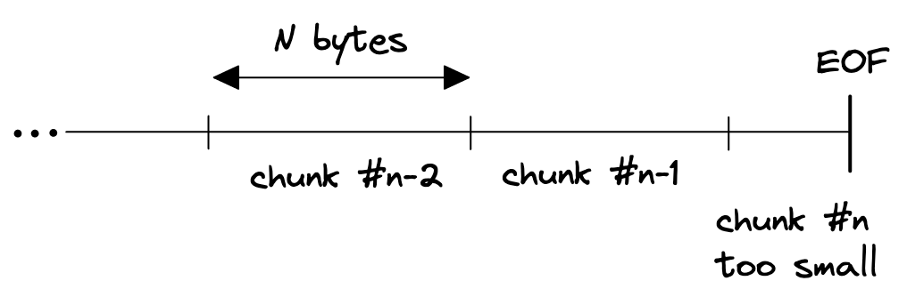
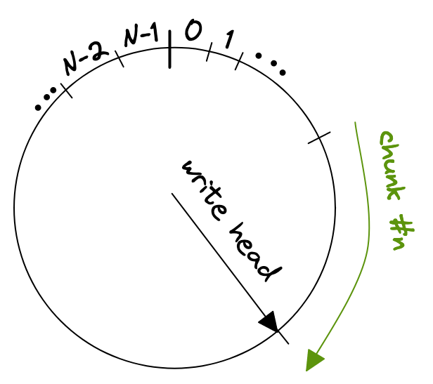

```json
{
  "author": "Andreas Linz",
  "title": "Reading the last bytes of a stream in Go",
  "description": "In this post I explain how to efficiently read the last bytes of a stream of file, just like the good old tail utility.",
  "created_at": "2022-10-05"
}
``` 

It's about half a year since my last blog post, so it's about time to write another one.

Yesterday I was working on a private project that required to read a block of bytes from the end of an `io.Reader`.
On a first glance that sounds like a trivial problem, but doing this _efficiently_ turned out to be more complicated than initially thought.

If your `io.Reader` stems from a file you're lucky, because regular files allow random access through the system [seek call](https://man7.org/linux/man-pages/man2/lseek.2.html) that is exposed on a `os.File` with its [`Seek` method](https://pkg.go.dev/os#File.Seek).  However, my function only accepts a plain `io.Reader` and not an `os.File`, so this option is out of question.

How can we read the last N bytes of a _finite_ stream of some kind?

## Naïve solution

A naïve solution would be to [read the whole file into memory](https://pkg.go.dev/io#ReadAll) and then discard everything except for some slice of bytes at the end.

```go
func readTail(r io.Reader, N int) ([]byte, error) {
	data, err := io.ReadAll(r)
	if err != nil {
		return nil, err
	}

	return data[len(data)-N:], nil
}
```

This is pretty wasteful and might require huge amounts of memory, depending on how long the stream you want to consume is.

## Two interleaved buffers

The next idea I had was to read the stream in chunks of size N, and discarding every chunk except the last one.
But this won't work because of a variety of reasons, first and foremost if the stream length is not an integer multiple of N then the last chunk might be incomplete since it is only the remainder of file size divided by chunk size (N).



So, why not maintain two buffers, one for the previous read and another one for the current read.
When reaching EOF we can then concatenate the second last read with the last and return an slice of size N, right?
This might work, but turns out to be pretty complicated because of how `io.Read` might behave.
A call to `Read` is not guaranteed to return `N` bytes, instead it might fill only a [part of the given buffer](https://cs.opensource.google/go/go/+/refs/tags/go1.19.2:src/io/io.go;l=60-61):

```go
// If some data is available but not len(p) bytes, Read conventionally
// returns what is available instead of waiting for more.
```

So, we can't easily fill the two buffers in an interleaved manner because a single read might not fill a whole buffer.
Of course, there's [`io.ReadFull`](https://pkg.go.dev/io#ReadFull) which takes care of reading exactly N bytes if available, but the logic would still be quite convoluted.

## Ring buffer

After dabbling around for a while with the solution I had, I realized that what I wrote looked almost like a [ring buffer](https://en.wikipedia.org/wiki/Circular_buffer).
With a ring buffer, sometimes also called circular buffer, we only need O(n) space instead of O(2n) as required with the previous concept.
The gist is to store each chunk in a ring buffer, wrapping around if it exceeds the end of the ring buffers internal array.



After we reached the end of the stream we can just return a slice from the ring buffer, starting from the write head and reaching back N bytes.
Those are two operations if we need to wrap around

```go
copy(dst[:N-wpos], ringbuf[wpos:])
copy(dst[N-wpos:], ringbuf[:wpos])
```

where `wpos` is the index of the write head.

One thing that bit me was that `io.Read` might return `io.EOF` together with a non-zero amount of bytes read, _or_ it could return `0, io.EOF` after the last call that returned a non-zero amount of bytes and a `nil` error.
This is [documented behavior](https://cs.opensource.google/go/go/+/refs/tags/go1.19.2:src/io/io.go;l=83) but could still be surprising.

```go
// An instance of this general case is that a Reader returning
// a non-zero number of bytes at the end of the input stream may
// return either err == EOF or err == nil. The next Read should
// return 0, EOF.
```

You can find an ugly example in [this playground](https://go.dev/play/p/M-WcpkVviGV) but be aware that you need to run it locally, since external URLs might not be resolved in the playground.

There are a number of performance considerations that arise from this implementation, e.g. a very small `N` might lead to a huge number of read calls if the ring buffer's size is equal to `N`.
Technically they are independent, the only condition is that the ring buffer must at least have a size of `N`.

You might've guessed it already but the good old `tail` utility serves the same purpose.  I haven't had a look in [GNU tail's source code](https://github.com/coreutils/coreutils/blob/master/src/tail.c) yet, but I'm curious to see how they achieved this.

I hope that helped someone.
Please let me know if you've an even more efficient solution or there is any other feedback for me.