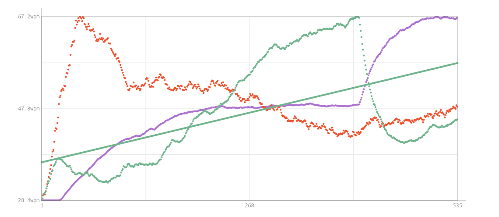

```json
{
  "author": "Andreas Linz",
  "title": "Learning Touch Typing",
  "description": "My experience of learning how to touch type, i.e. how to write on a keyboard using 10 fingers.",
  "created_at": "2021-10-30",
  "tags": ["practices"],
  "hidden": false
}
```

# Learning Touch Typing

Lately two articles about developer productivity appeared in my news feed.  The first was [speed matters][sm], which is part of the great [reflections on a decade of coding][roadc] article series, and second is [some reasons to work on productivity and velocity][pv] by Dan Luu.  Both articles stated that [touch typing][wiki] improved their productivity.  The productivity boost was not limited to a bare increase in word per minute that one can type, instead the greater leverage comes from an increased accuracy.  Making less typing errors improves the writing flow because every typo requires a context switch in order to fix the mistake.  Jamie Brandon wrote:

> If you compare two coders, one who can touch type and one who has to hunt and peck, the difference between them is not just down to typing speed. The hunter-and-pecker has to think about typing! This consumes attention and short-term memory that is sorely needed for thinking about the program itself.

Dan Luu  wrote this about typing speed:

> I've actually looked at where my time goes and a lot of it goes to things that are canonical examples of things that you shouldn't waste time improving because people don't spend much time doing them.
> 
> An example of one of these, the most commonly cited bad-thing-to-optimize example that I've seen, is typing speed (when discussing this, people usually say that typing speed doesn't matter because more time is spent thinking than typing). But, when I look at where my time goes, a lot of it is spent typing.

Reading both articles motivated me to give it another try.  I was satisfied with the speed of my self learned four finger typing method but what actually annoyed me was how many typing errors I made.  One thing that I can say for sure is fixing too many typing mistakes let me loose my "flow".

Learning how to touch type takes a lot of dedication, it feels like learning an instrument or how to play the piano (even though it's quite a bit easier).  The hardest part for me was to realize that touch typing will be a lot slower that my current technique until I get more comfortable with it.  As always, learning something takes practice, practice and even more practice.

Learning touch typing begins with the home row, this is the middle row of your keyboard where your fingers will rest and return to after hitting any key.  For the basics I used [typingtom.com][tt] with which I learned how to type on the home and top row after a day or two.  But the lessons were too repetitive, so they quickly became boring.  Luckily there are a bunch of alternatives from which I chose [keybr.com][keybr] because it provided some nice statistics for tracking the learning progress and the lessons used random but readable and pronounceable words spit out by some word generating algorithm.  Following is the progress chart after about a week of practicing touch typing:



The green line shows typing speed in words per minute, red is the number of errors and (kind of) purple is the number of keys in the lesson.  It took me about five days to learn all characters and to get as fast, if not even a bit faster, as with my previous hunt and peck approach.  In the last quarter of the graph you can see a steep decline in typing speed and this is because I activated capitalization and symbols.  On a US QWERTY keyboard most common symbols are located on the right half, hence they must be hit with the right hand pinky.  For me, one of the hardest things was learning to type with my pinky and ring finger.

Now it's all about practicing and getting back to speed.  For this reason I forced myself to write this article using touch typing which went okay but could have been a bit smoother 🙄  Anyways, if you now decide to learn this skill as well I wish you all the best 💪.  It's not as hard to learn as you might think and it should only take a month of typing to become fast and accurate.

[wiki]: https://en.wikipedia.org/wiki/Touch_typing
[sm]: https://scattered-thoughts.net/writing/speed-matters/
[roadc]: https://scattered-thoughts.net/writing/reflections-on-a-decade-of-coding/
[pv]: https://danluu.com/productivity-velocity/
[tt]: https://www.typingtom.com/lessons
[keybr]: https://www.keybr.com